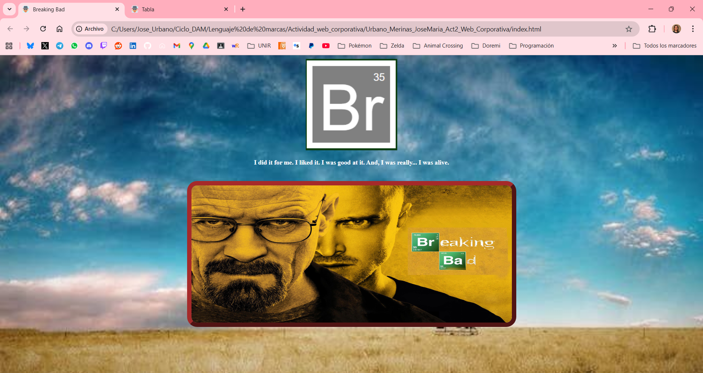
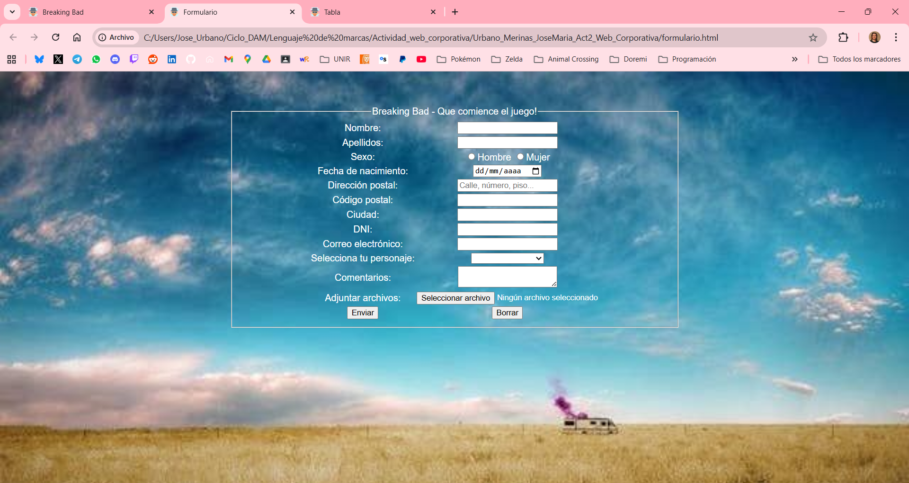
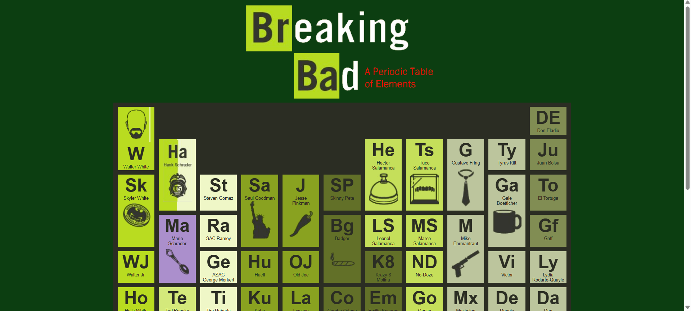
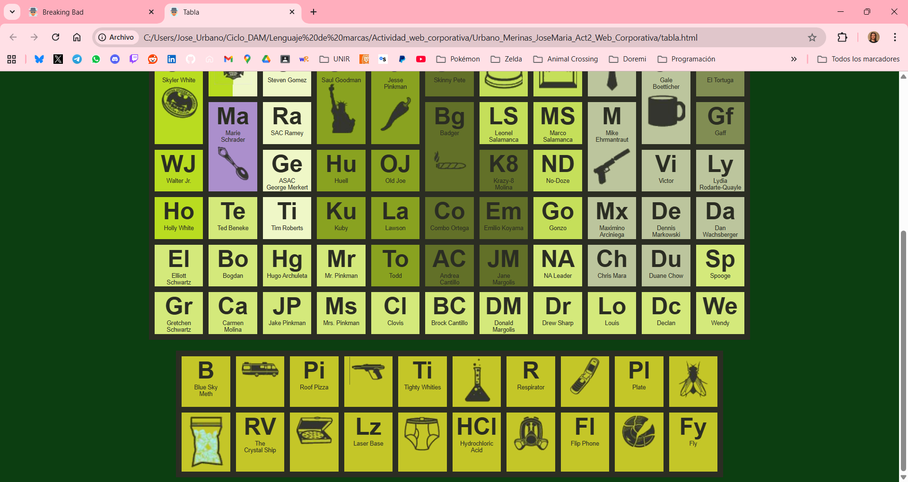

# Breaking Bad Web

📚 DAM – Lenguajes de Marcas  
✍️ Entrega - proyecto web inspirado en la serie **Breaking Bad** con formulario y tabla de personajes.

## 🛠️ Tecnologías

## ⚙️ Funcionalidad
- **Página principal** con logo, cita de la serie y un póster interactivo.  
- **Formulario** de inscripción con temática Breaking Bad.  
- **Tabla periódica** de personajes y elementos característicos de la serie.  

## 📸 Vista previa
Interfaz web con formulario y tabla de personajes.

Página de inicio con título mapeado

Formulario

Tabla periódica

